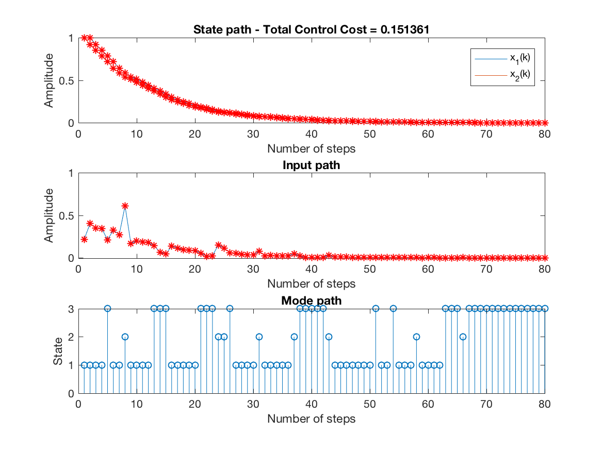
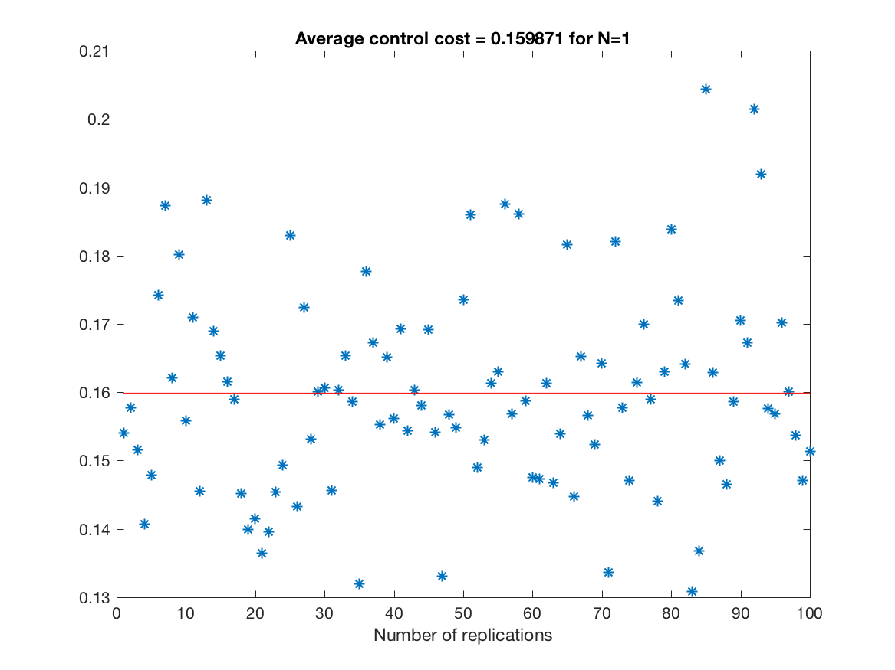
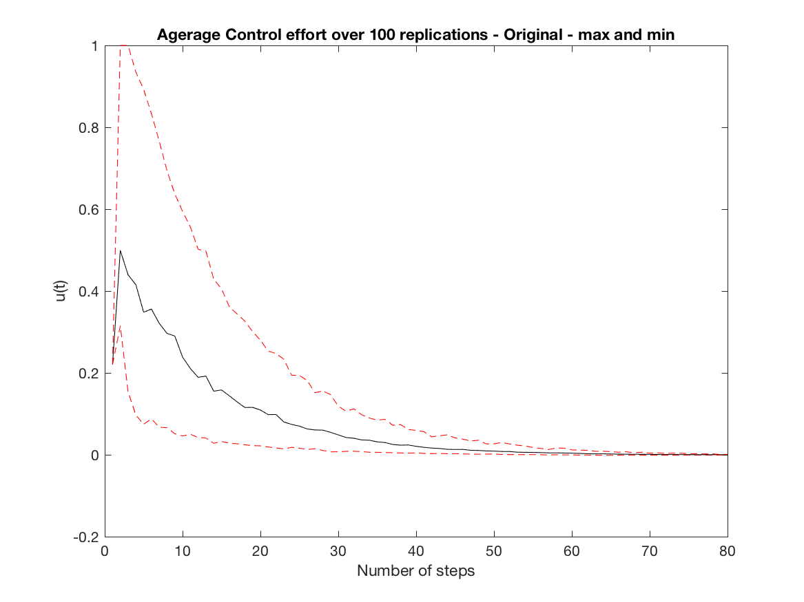
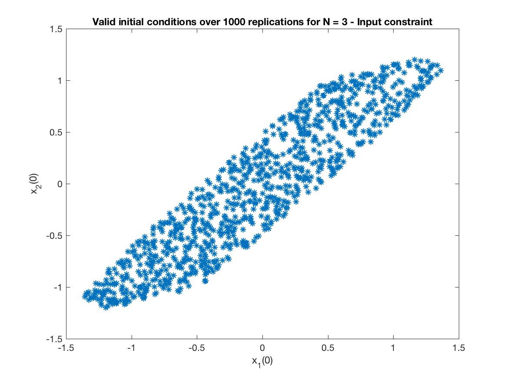

# Constrained-model-predictive-control-synthesis

Constrained-model-predictive-control-synthesis is an attempt to implement the ideas laid out in the paper Lu, J., D. Li and Y. Xi (2013). "Constrained model predictive control synthesis for uncertain discrete-time Markovian jump linear systems." IET Control Theory & Applications 7(5): 707-719. See [(Lu et al, 2013)](https://doi.org/10.1049/iet-cta.2012.0884).

A matlab code is provided that uses [Yalmip](https://yalmip.github.io) with [sedumi](https://github.com/SQLP/SeDuMi) or [mosek](http://www.mosek.com). It is assumed that all the necessary packages are already installed in the MATLAB environment. If not you can uncomment a few lines in the main script and change them accordingly.

# The MATLAB mfiles

## The main script

The main script is the file "Example_Constrained".

Just type the name after the prompt and the script will take care of running the example given in the paper.

Please remember to set the path for yalmip, sedumi or mosek before calling it. In the script you will find the following lines:

addpath(genpath('~/Documents/MATLAB/yalmip'))

addpath(genpath('~/Documents/MATLAB/cvx/sedumi'))

addpath(genpath('~/Documents/MATLAB/cvx/sdpt3'))

addpath(genpath('~/mosek/8/toolbox/r2014a'));

Please change them accordingly.

In the script you will find the following main flags: 

1) *flagc* - if it is set to 1 the constrained problem on the input will be solved. It it is set to 2 the constrained problem on the state and input will be solved otherwise an unconstrained problem will be solved. 

2) *flagx* - if *flagx* = 0, the initial conditions for the states *x* are always 1, that is, *x*(:,1)=[1;1] (You can change the values by editing the script).  If *flagx* = 1, the initial conditions are chosen randomly from an uniform distribution U(-*umax*,*umax*), where the value of umax can be chosen by editing the script.  The default is *flagx*=0. 

3) *flagr* - if *flagr* = 0, the initial mode is set to 1 (as in the paper).  If *flagr* = 1, the initial model is randomly chosen from the set {1,2,3}. 

The main parameters are:

* The number of replication is set to 100. If there is a need to change the value, use the variable *nrep* in the beginning of the script.

* The maximum input value is set to 1 using the variable *umax*.  

* The maximum value of the initial states is set to 1.5 using the variable *xmax*.  Such a veriable not only controls the maxinum value used for generating the initial conditions (constrained problem) but also the maximum allowed value in the state constrained problem.

* The number of steps in each replication (simulation) is set using the variable *ksteps*.  The default is *ksteps* = 80 (as in the paper). 

* The prediction control estrategy can be controlled using the variable *N* in the main script.  The default is *N* = 1.

A couple of observations:

**Obs. 1**: As it is the code fails for some initial conditions when solving the constrained problem.  The reason is that **Theorem 2** is violated. When this happens, a message will come out showing the initial condition.  I have not tested values outside the range *x0*=[-1.5,1.5] for the unconstrained problem (**Theorem 1**).

**Obs. 2**: As it is the code is set to run using mosek instead of sedumi.   

**Obs. 3**: I thank Dr. Lu for patiently answering my questions.  

## Some useful information

All the LMIs are coded using a string variable which is later converted to LMIs.  For instance if the content of *LMI 21* needs to be checked, just issue the following command after the matlab prompt

`>> auxm21`

and you will see

auxm21 =

  2×2 cell array

    'G(:,:,n,i)'+G(:,:,n,i)-mathW(:,: ...'    '(A{l,i}*G(:,:,n,i)+B{l,i}*Y(:,:, ...'
    '(A{l,i}*G(:,:,n,i)+B{l,i}*Y(:,:, ...'    'mathW(:,:,min(N,n+1),j);'          

The sdpvar version of the same LMI can be found in the variable called m21 which is a cell array. *LMI 21* is pilled up in the variable called *biglmi21* that together with all other LMIs (*biglmi11*, *biglmi15*, ...) results in a single big LMI - *LMIs_orig* (procedure_jianbo_esp.m)

The same rationale is used for all other LMIs, that is, *LMI 11*, *LMI 15*, *LM 16*, *LMI 20*, *LMI 21*, *LMI 23*, *LMI 24*, *LMI 25* (two parts) and *LMI 26* (two parts).  Depending on how the function *phi* is chosen (See page 712), LMI 24 becomes an simple inequality.  The implemented code deals with that but I am not sure if this is the best way to do it.

The m-files are commented as much as possible.

If you find any mistake please let me know.  Thanks.

# Example

Here it is an example of runing the script using the default values.

* State, input and mode paths for the last replication (unconstrained simulation) - 

* Control Cost over all replications (unconstrained simulation) - 

* Average Control effort over all replications (unconstrained simulation) - 

* Monte Carlo simulation (Input Constrained Problem) of Figure 4 - Comparision of the maximal feasible regions.  Only for Controller IV - 

